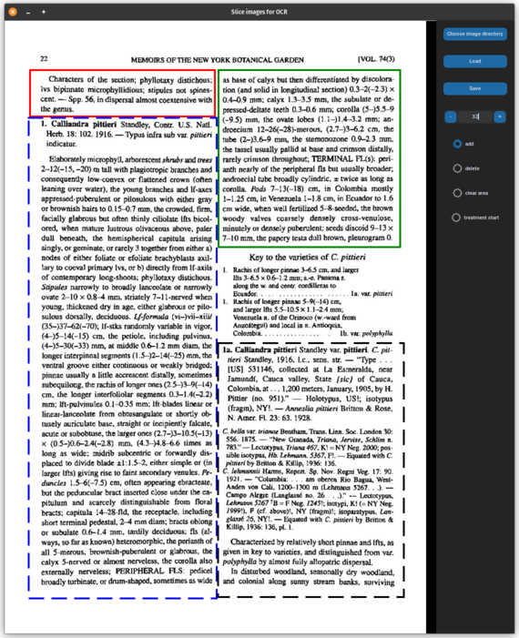

# pdf_parsers

Utilities to prepare PDF files for OCR.

## Install

Install the poppler utilities.
On Ubuntu Linux this looks like: `sudo apt install poppler-utils`.
Fedora: `sudo dnf install poppler-utils`.

```bash
cd /path/to/pdf_parsers
source .venv/bin/activate
```

## Utilities

### Rename PDFs

This is strictly a personal preference, but I like to keep the PDF names free of
spaces and other odd characters. Have a backup before running this utility.

```bash
rename_pdfs.py --pdf-dir /path/to/pdfs
```

### Convert PDFs to images

First we need to convert the PDF into images so that we can run an OCR program
on it. This script output one image file per page.

Example:

```bash
pdf_to_images.py --in-pdf /path/to/treatments.pdf --image-dir /path/to/treatment/images
```

### Fix image page numbers

Sometimes the `pdf-to-images` output has names that do not sort in order,
which will mess up the `slice-gui` script (below). This utility may fix this.
I rarely need this utility, but when you need it, you will be glad you have it.

Example:

```bash
fix_page_nos.py --image-dir /path/to/treatment/images --glob '*.jpg'
```

### Slice images into text areas

This script allows you to manually outline text on images from `pdf-to-images`
with bounding boxes that contain description text. The boxes on a page must be
in reading order. You need to mark which boxes are at the start of a description.

The output is a JSON file that holds the images paths and notes about the
boxes drawn on them.

Example:

```bash
slice.py
```

[](assets/slice_example.png)

In this example the areas start at the top left and end at the bottom right,
going down the columns. In order:

1. The top left box (red) holds the final text from a previous description.
2. The bottom left box (blue) holds the start of the next description.
The description start is indicated by a dashed box.
3. The top right box (green) holds the second portion of the description
started in #2.
4. The bottom right box (black) holds the start of another description.
Another dashed box.

- Notice that the header and key in the middle of the right column are skipped.
- You are able to mark boxes as "clear area" which I use to remove diagrams that
are embedded in the text and would be cumbersome to draw boxes around.

### Turn image slices into separate images

Take the coordinates saved from the slice.py utility and create images from them.

```bash
slices_to_images.py --slices-json /path/to/slices.json --image-dir /output/images/
```
